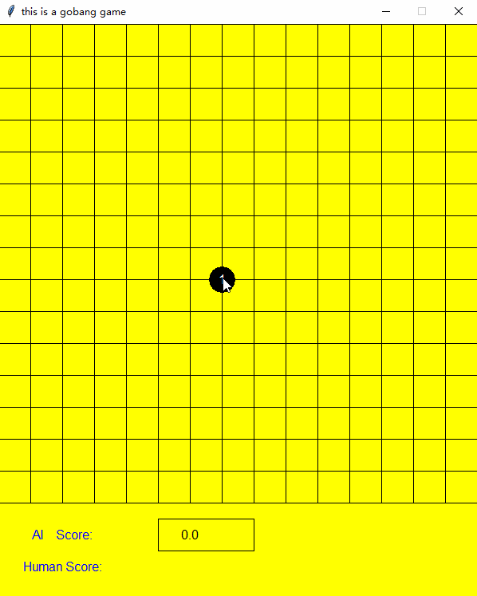
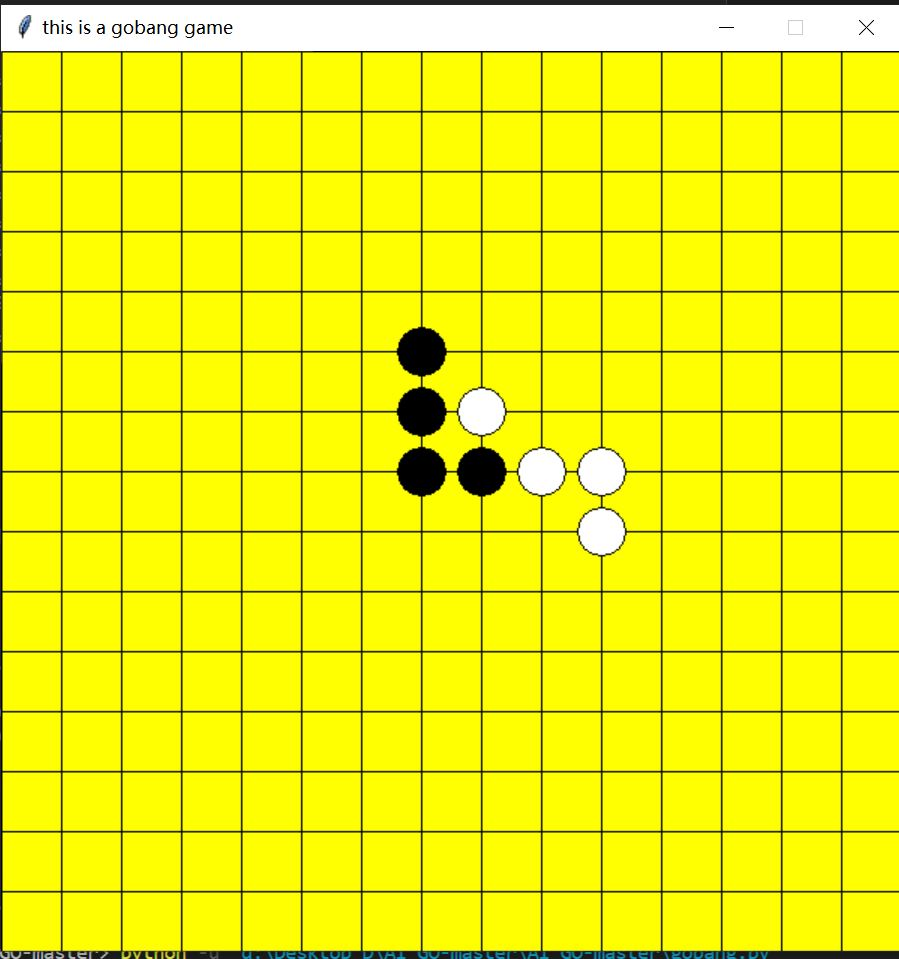
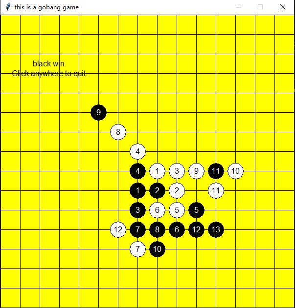

# AI_GO 汪俊威 3170105970
My AI course project based on alpha-belta pruning

>1.重点实现棋局评价，博弈树剪枝<br>
    2.尽可能比较不同评价策略或优化搜索，要有实验数据支持
## 验收效果
<p align="center">
    
    
</p>

### 棋局评价
* 基于五子棋的得分规则，设计不同得分判据
```python
shape_score = [(50, (0, 1, 1, 0, 0)),       #　活２
               (50, (0, 0, 1, 1, 0)),       #  活2
               (200, (1, 1, 0, 1, 0)),      #  缺一4
               (500, (0, 0, 1, 1, 1)),      #  边3
               (500, (1, 1, 1, 0, 0)),      #  边3
               (4000, (0, 1, 1, 1, 0)),     #  活3
               (5000, (0, 1, 0, 1, 1, 0)),  #  活3(缺1活4)
               (5000, (0, 1, 1, 0, 1, 0)),  #  活3
               (5000, (1, 1, 1, 0, 1)),     #  缺一5
               (5000, (1, 1, 0, 1, 1)),     #  缺一5
               (5000, (1, 0, 1, 1, 1)),     #  缺一5
               (4499, (1, 1, 1, 1, 0)),     #  边4
               (4499, (0, 1, 1, 1, 1)),     #  边4
               (100000, (0, 1, 1, 1, 1, 0)),#  活4
               (99999999, (1, 1, 1, 1, 1))] #  WoW  What a coincidence！

```
* 在纵横斜四个方向上探查某一点周围的点的情况
```python
my_score += cal_score(m, n, 0, 1, enemy_list, my_list, score_all_arr)   # 水平方向得分
my_score += cal_score(m, n, 1, 0, enemy_list, my_list, score_all_arr)   # 述职方向得分
my_score += cal_score(m, n, 1, 1, enemy_list, my_list, score_all_arr)   # 左斜方向得分
my_score += cal_score(m, n, -1, 1, enemy_list, my_list, score_all_arr)  # 右斜方向得分
```

### 博弈树剪枝
* α-β剪枝算法

    
* 原理
    一种倒推对抗性搜索算法，可以减少**极小化极大值搜索**树节点数，当算法评估出某策略的后续走法比之前的策略还差时，就会停止计算该策略的后续发展
* 本文代码
```python
def negamax(is_ai, depth, alpha, beta):
    '''
    负值极大算法搜索 alpha + beta剪枝
    :param is_ai: 是否是ai轮
    :param depth: 搜索深度
    :return: alpha or beta（需要补全）
    '''
    # 游戏是否结束 | | 探索的递归深度是否到边界
    if game_win(list1) or game_win(list2) or depth == 0:
        return evaluation(is_ai)
    
    blank_list = list(set(list_all).difference(set(list3)))
    order(blank_list)   # 搜索顺序排序  提高剪枝效率
    # TODO: 对每一个候选步进行递归并剪枝，将最后决策出的next_point赋值，将函数剩下部分补全
    # .....
    for next_step in blank_list[::]:
        # 如果要评估的位置没有相邻的子，则不去评估 减少计算 
        if not has_neightnor(next_step):
            continue
        if is_ai:
            list2.append(next_step)
        else:
            list1.append(next_step)
        list3.append(next_step)
    
        value = -negamax(not is_ai, depth - 1, -beta, -alpha)
        if is_ai:
            list2.remove(next_step)
        else:
            list1.remove(next_step)
        list3.remove(next_step)
    
        if value > alpha:
            if depth == DEPTH:
                next_point[0] = next_step[0]
                next_point[1] = next_step[1]
            if value >= beta:
                return beta
            alpha = value
    return alpha
```
### 运行情况
* 用TA提供的得分评价函数在大部分情况都是比较好的。有几次都输给AI了
* 有一些情况不如人意，我们经验推测在攻与受的抉择之间的
    * 比如我方的活3 **（01110)** 不堵住去成自己的 半边4 **-11110** 这样子
    <p align="center">
        
    </p>
    <br>这种情况我觉得应该减少边4的分数，适当改善攻守关系

    * 还有一些情况，比如交叉3的得分会翻倍，直接让 **5000x2 == 10000** 
      但是交叉3至少需要两步才能成功，即使是一定成功，但是我方的边4只需要一布就能赢了
        <p align="center">
            
        </p>
    
    * 在Depth = 1、2的时候比较简单，AI会马上给出步骤。但是当Depth = 4时，AI会越来越慢。
    * 运算数据比较大，用数组存储的方法，有一定的可行性。标准的五子棋棋盘15X15。
    <br>但是一个问题是：**一个刚落到棋盘的棋子**会影响半径为10的棋子的得分，在纵横斜四个方向上
    <br>  1********1 ，直径20比棋盘还大，绝大部分棋子会覆盖其中，而且has_neightnor()函数会
    <br>过滤掉一些点。
    

    
